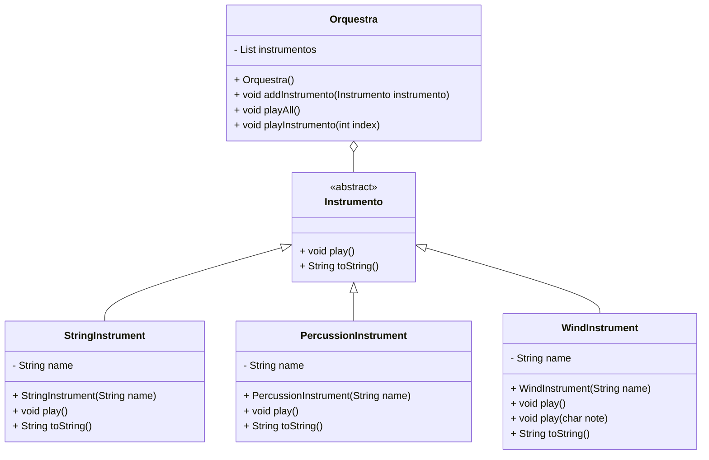

# Minha Própria Orquestra

## Descrição

Este projeto implementa uma orquestra simples com diferentes tipos de instrumentos musicais. Utilizando conceitos de polimorfismo e herança, criamos uma estrutura que permite tocar instrumentos de corda, percussão e sopro.

## Estrutura do Projeto

### Diagrama de Classes



### Classe Abstrata `Instrumento`

A classe `Instrumento` é abstrata e define dois métodos abstratos:
- `play()`: Para tocar o instrumento.
- `toString()`: Para obter uma descrição do instrumento.

### Classes de Instrumentos

#### `StringInstrument`
Representa instrumentos de corda, como violão e violino.
- Implementa o método `play()` para produzir um som característico de corda.
- Implementa o método `toString()` para retornar uma descrição do instrumento.

#### `PercussionInstrument`
Representa instrumentos de percussão, como tambor e pratos.
- Implementa o método `play()` para produzir um som constante de percussão.
- Implementa o método `toString()` para retornar uma descrição do instrumento.

#### `WindInstrument`
Representa instrumentos de sopro, como flauta e trompete.
- Implementa o método `play()` para produzir um som característico de sopro.
- Sobrecarga do método `play(char note)` para tocar uma nota específica.
- Implementa o método `toString()` para retornar uma descrição do instrumento.

### Classe `Orquestra`

A classe `Orquestra` gerencia uma lista de instrumentos e permite tocar todos os instrumentos em sequência ou selecionar um instrumento específico para tocar.

## Uso

### Criação de Instrumentos e Adição à Orquestra

```java
Orquestra orquestra = new Orquestra();

Instrumento violao = new StringInstrument("Violão");
Instrumento tambor = new PercussionInstrument("Tambor");
WindInstrument flauta = new WindInstrument("Flauta");

orquestra.addInstrumento(violao);
orquestra.addInstrumento(tambor);
orquestra.addInstrumento(flauta);
```

### Tocando Todos os Instrumentos

```java
orquestra.playAll();
```

### Tocando um Instrumento Específico

```java
orquestra.playInstrumento(2);  // Toca o terceiro instrumento (flauta)
flauta.play('C');  // Toca uma nota específica na flauta
```

## Contribuição

Contribuições são bem-vindas! Sinta-se à vontade para abrir uma _issue_ ou enviar um _pull request_.

## Licença

Este projeto está licenciado sob a Licença MIT. Veja o arquivo [LICENSE](LICENSE) para mais detalhes.